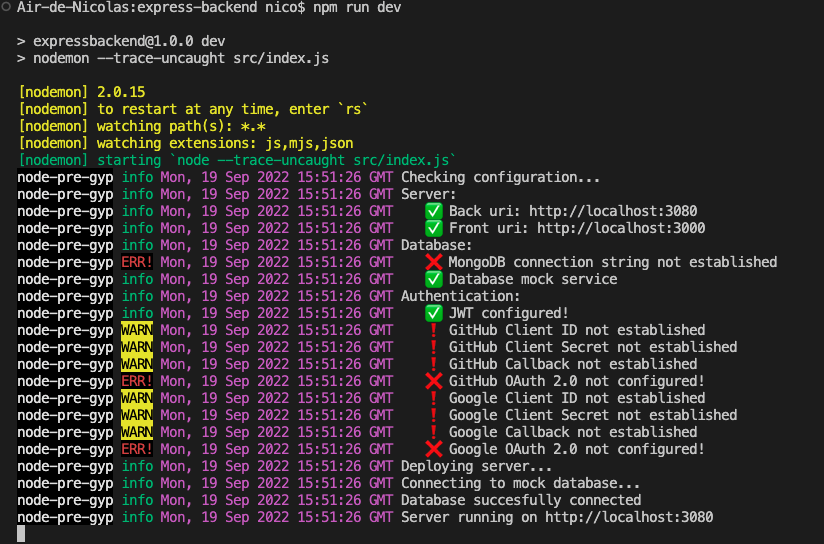
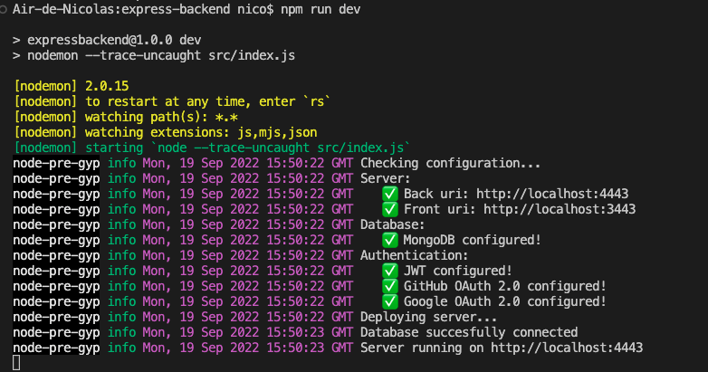
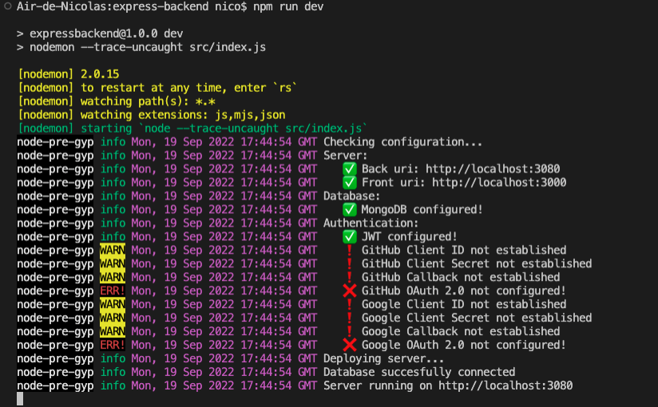

# Express Backend

## Versions:
- **SO**: macOS 12.4
- **NodeJS**: v14.16.0
- **NPM**: 7.6.3


## Quick start:

1. Install dependencies:

    ```powershell
        npm install
    ```

2. Basic deploy:

    ```powershell
        npm run dev
    ```

3. You should see something like this:

    

4. **Do not panic!** The server is running on `http://localhost:3080` and the features available are:
    * Login and Sign up with credentials.
    * Session management with Jason Web Token.

5. Follow the steps below for full setup.

## Full setup sample:


### Running complete setup

After setup the whole configuration below you should see something like this:




### 1. Create `.env` file

Check `.env.sample` to see an environment setup sample and rename as `.env`.

```
### .env
### -----

# Back Configuration
BACK_HOST=localhost
BACK_PORT=3080

# Front Configuration
FRONT_HOST=localhost
FRONT_PORT=3000

# MONGODB Configuration
DB_CONNECTION_STRING=

# JWT Configuration
TOKEN_SECRET=

# OAuth2.0 GitHub Provider Configuration
GITHUB_AUTH_CLIENT_ID=
GITHUB_AUTH_CLIENT_SECRET=

# OAuth2.0 - Google Provider Configuration
GOOGLE_AUTH_CLIENT_ID=
GOOGLE_AUTH_CLIENT_SECRET=

# Endpoint to receive authorization code from Auth Provider
CLIENT_GITHUB_CALLBACK_URL=/oauth/github/callback
CLIENT_GOOGLE_CALLBACK_URL=/oauth/google/callback

# Redirections if login success or fail
SUCCESSFUL_LOGIN_REDIRECT=http://<FRONT_HOST>:<FRONT_PORT>/login/success
FAILED_LOGIN_REDIRECT=http://<FRONT_HOST>:<FRONT_PORT>/login/failed
```


### 2. Setup MongoDB connection string:

> **NOTE**: The database is mocked for testing so you can skip this configuration for the time being, unless you need persistance or just understand how it works.

1. Go to [MongoDB](https://www.mongodb.com/), create a database and get the connection string.

```text
    // It should look like this
    mongodb+srv://admin:<password>@<your.app>.2amgq.mongodb.net/?retryWrites=true&w=majority
```

2. Copy your connection string in the `.env` file.

```
# MONGODB Configuration
DB_CONNECTION_STRING=mongodb+srv://admin:<password>@<your.app>.2amgq.mongodb.net/?retryWrites=true&w=majority
```


3. Run the server again and the MongoDB log entry should be checked:

    


### 3. Setup GitHub OAuth 2.0:

> Follow instructions in the [GitHub documentation](https://docs.github.com/en/developers/apps/building-oauth-apps/creating-an-oauth-app).

1. Go to your GitHub account and open [Developer Settings](https://github.com/settings/developers).

2. Create a new **OAuth App**. And fill the following fields:

    * **Homepage URL**. For example: `http://localhost:3000/`
    * **Authorization callback URL**. For example: `http://localhost:3080/api/v1/oauth/github/callback`

3. Go to your `.env` file.

    * Set the same **Homepage URL** value in "Front Configuration":

        ```
        # Front Configuration
        FRONT_HOST=localhost
        FRONT_PORT=3000
        ```

    * Set the same **Authorization callback URL** value in "Back Configuration":
    
        ```
        # Back Configuration
        BACK_HOST=localhost
        BACK_PORT=3080
        ```

4. Finally, set the **Client ID** and **Client Secret**:

    ```
    # OAuth2.0 - GitHub Provider Configuration
    GITHUB_AUTH_CLIENT_ID=
    GITHUB_AUTH_CLIENT_SECRET=
    ```

### 4. Setup Google OAuth 2.0:

> Follow instructions in the [Google documentation](https://developers.google.com/identity/protocols/oauth2/javascript-implicit-flow).

1. Create an account on [https://cloud.google.com/](https://cloud.google.com/).

2. Create a new project.

3. Open **APIs & Services/OAuth consent screen** tab and follow Google configuration steps.

    * OAuth consent screen:
        * Use `External` user type.
        * Fill required inputs.
    * Scopes. Add the following scopes:
        * `.../auth/userinfo.email`
        * `.../auth/userinfo.profile`
    * Test users:
        * Nothing.
    
4. Go to **APIs & Services/Credentials**:

    * Select `Create OAuth client ID`.
    * Select `Web Application`.
    * Authorised JavaScript origins. For example: `http://localhost:3000`.
    * Authorised redirect URIs. For example: `http://localhost:3080/api/v1/oauth/google/callback`.
    * Save.

5. Go to your `.env` file and set the previous **Authorised JavaScript origins** data in the "Front Configuration":

    ```
    # Front Configuration
    FRONT_HOST=localhost
    FRONT_PORT=3000
    ```

6. Go to your `.env` file and set the previous **Authorised redirect URIs** data in the "Back Configuration":

    ```
    # Back Configuration
    BACK_HOST=localhost
    BACK_PORT=3080

    # Endpoint to receive authorization code from Auth Provider
    ...
    CLIENT_GOOGLE_CALLBACK_URL=/oauth/google/callback
    ```

7. Finally, set the **Client ID** and **Client Secret**:

    ```
    # OAuth2.0 - Google Provider Configuration
    GOOGLE_AUTH_CLIENT_ID=
    GOOGLE_AUTH_CLIENT_SECRET=
    ```

