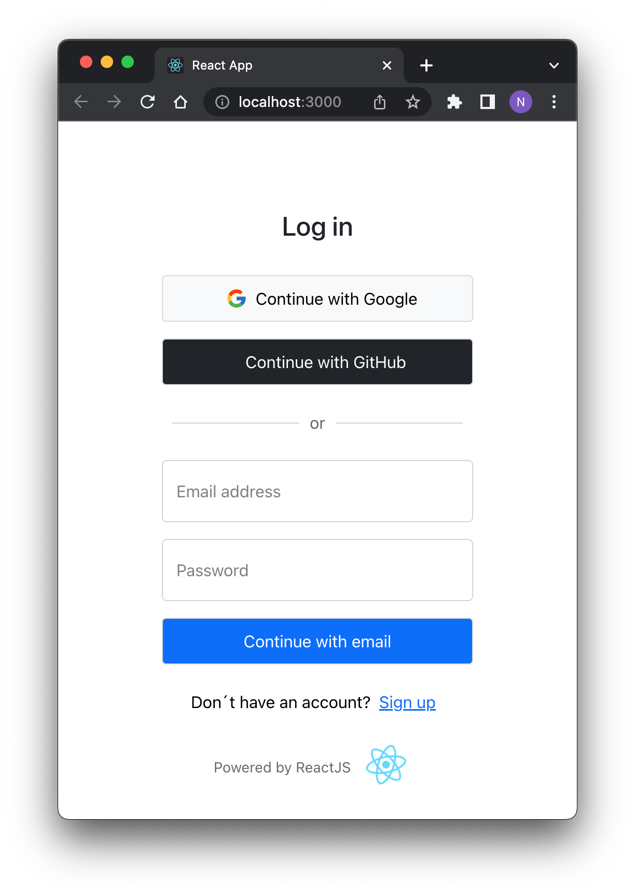
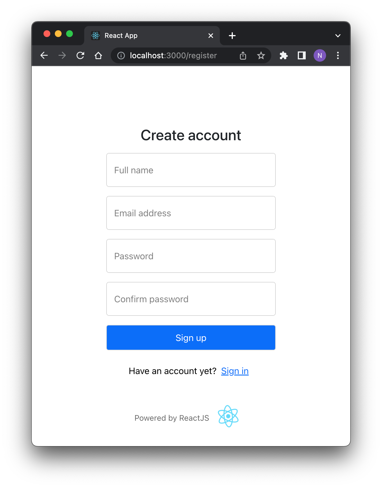

# React Web App

## Quick start:

1. Install dependencies:

    ```powershell
        npm install
    ```

2. Local deploy:

    ```powershell
        npm start
    ```

3. You should see something like this:

    

> **NOTE**: the front-end asks the back-end for the status of the OAuth 2.0 Services. If Google or GitHub authentication is not configured on the backend, the React login page does not display the option to login.

4. Also you can create an account in the system without using OAuth 2.0. 

    


## Versions:
- **SO**: macOS 12.4
- **NodeJS**: v14.16.0
- **NPM**: 7.6.3
